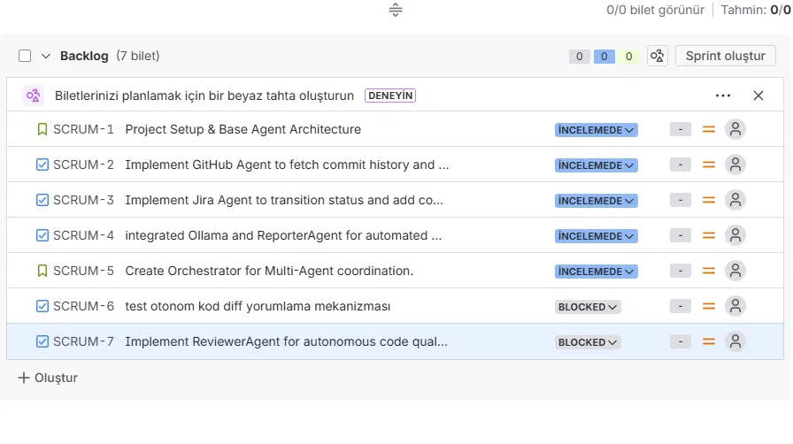
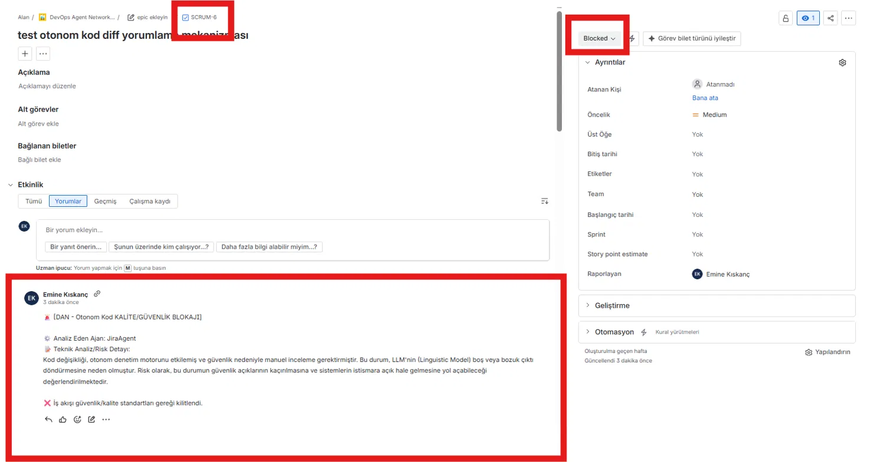

# DevOps Agentic Network (DAN)

Lokal LLM (Ollama / Llama 3.1) destekli, dinamik karar mekanizmasına sahip otonom bir Multi-Agent DevOps entegrasyon projesi. Bu sistem; GitHub üzerindeki geliştirici aktivitelerini analiz eder, kod kalitesi/güvenlik denetiminden geçirir, Jira panolarını otonom olarak günceller ve kurumsal sürüm raporları (Release Notes) üretir.

---

## 🎼 Proje Mimarisi (Agentic Workflow)

Proje, hardcoded (düz kod) ardışık bir pipeline yerine, gücünü **Orchestrator Agent (Şef Ajan)** mimarisinden alır. Kullanıcıdan gelen doğal dil hedefi doğrultusunda alt ajanların çalışma sırasına ve hangilerinin tetikleneceğine lokal yapay zeka kendisi karar verir.

* **GitHubAgent:** Belirtilen canlı repodan son commit geçmişini ve diff'lerini tarar. Bilet ID'lerini önce regex ile (config'den okunan proje anahtarına göre, örn. `SCRUM-X`) yakalamaya çalışır; regex hiçbir eşleşme bulamazsa serbest formatlı mesajlar (`"fixes #123"` gibi) için lokal LLM ile semantik analiz devreye girer.
* **ReviewerAgent:** Sadece değişen kod satırlarını (git diff) lokal LLM ile güvenlik ve kalite denetiminden geçirir. **Fail-closed** tasarım: denetim mekanizması bir hata/boş yanıt alırsa kodu otomatik "güvenli" saymaz, iş akışını durdurup manuel incelemeye düşürür.
* **JiraAgent:** Ayıklanan biletleri Atlassian API üzerinden canlı panoda bulur, ReviewerAgent'ın sonucuna göre durumlarını dinamik olarak `In Review` (denetim geçti) veya `Blocked` (denetim kaldı/başarısız) aşamasına çeker ve otonom teknik analiz/risk raporunu yorum olarak ekler.
* **ReporterAgent:** Ham geliştirici commit mesajlarını kıdemli bir Teknik Ürün Yöneticisi (TPM) tonunda, iş odaklı kurumsal bir Türkçe Markdown Sürüm Bültenine dönüştürür. Güvenlik blokajı durumunda tetiklenmez.

---

## 🧠 Otonom Karar Mekanizması & Log Örneği

Sistemin esnekliğini kanıtlayan, koda dokunmadan sadece `user_goal` değiştirilerek tetiklenen otonom planlama çıktısı:
### user_goal : "GitHub reposundaki son değişiklikleri incele, ilgili Jira kartlarını güncelle ve teknik bülteni hazırla."
```json
==================================================
🧠 OLLAMA TARAFINDAN OLUŞTURULAN OTONOM İŞ PLANI:
==================================================
{
  "plan": ["github_agent", "reviewer_agent", "jira_agent", "reporter_agent"],
  "reason": "GitHub'dan son commitleri okuyup kod kalitesi/güvenlik denetiminden geçirmek, ardından Jira'daki kartları güncellemek için sırasıyla github_agent, reviewer_agent, jira_agent çalıştırılmalı, ardından reporter_agent ile teknik bülten hazırlanmalıdır."
}
==================================================
```

### user_goal : "GitHub reposundaki son değişiklikleri incele ve sadece teknik bülteni hazırla. Kesinlikle Jira kartlarında bir güncelleme yapma."
```json
==================================================
🧠 OLLAMA TARAFINDAN OLUŞTURULAN OTONOM İŞ PLANI:
==================================================
{
  "plan": ["github_agent", "reporter_agent"],
  "reason": "GitHub reposundaki son değişiklikleri incelemek için github_agent'ı çalıştırmak ve teknik bülten hazırlamak için reporter_agent'ı çalıştırmak gerekir."
}
==================================================
```

---

## 🚨 Demo: Fail-Closed Güvenlik Kapısı

ReviewerAgent, otonom denetim sırasında bir hata veya kritik risk tespit ettiğinde sistem **fail-open değil fail-closed** davranır — yani şüpheli/analiz edilemeyen bir durumda kodu otomatik geçirmek yerine iş akışını durdurur ve insan onayına düşürür. Aşağıda gerçek bir çalıştırmadan alınan kanıt:

**1) Terminal çıktısı — Reviewer denetimi tamamlayamıyor, Orchestrator akışı kilitliyor:**
```
INFO:ReviewerAgent:🧠 ReviewerAgent: Lokal LLM (Ollama) ile otonom kod kalitesi ve güvenlik analizi başlatılıyor...
ERROR:ReviewerAgent:❌ ReviewerAgent LLM analizi veya JSON parse sırasında hata aldı: ...
WARNING:OrchestratorAgent:🚨 Kritik kod kalitesi veya güvenlik riski saptandı! İş akışı kilitlenecek.
[Orchestrator] ⚙️ LLM Kararı: jira_agent tetikleniyor...
INFO:OrchestratorAgent:❌ Kod onay almadığı için Jira bileceğine blokaj verisi ve yorumu hazırlanıyor.
...
INFO:JiraAgent:✅ SCRUM-6 başarıyla 'Blocked' aşamasına çekildi.
INFO:JiraAgent:✅ SCRUM-7 başarıyla 'Blocked' aşamasına çekildi.
==================================================
📝 ŞEF AJAN DENETİMİNDE TAMAMLANAN NİHAİ RAPOR:
==================================================
Akış tamamlanamadı.
```
Reporter Agent bu senaryoda hiç tetiklenmedi — güvenlik blokajı olduğu için sürüm bülteni üretilmedi.

**2) Jira panosu — biletler otomatik olarak `Blocked` durumuna geçti:**



**3) Bilet detayı — JiraAgent'ın otonom yazdığı risk açıklaması:**



> 🤖 **[DAN - Otonom Kod KALİTE/GÜVENLİK BLOKAJI]**
> Analiz Eden Ajan: JiraAgent
> Teknik Analiz/Risk Detayı: Kod değişikliği, otonom denetim motorunu etkilemiş ve güvenlik nedeniyle manuel inceleme gerektirmiştir. Bu durum, LLM'nin boş veya bozuk çıktı döndürmesine neden olmuştur. Risk olarak, bu durumun güvenlik açıklarının kaçırılmasına ve sistemlerin istismara açık hale gelmesine yol açabileceği değerlendirilmektedir.
> ❌ İş akışı güvenlik/kalite standartları gereği kilitlendi.

---

## 🛠️ Hızlı Başlangıç

### 1. Ön Koşullar
- Python 3.11+
- [Ollama](https://ollama.com) kurulu ve çalışır durumda (`ollama serve`), kullanılacak model çekilmiş olmalı (örn. `ollama pull llama3.1`)
- Bir GitHub Personal Access Token (repo okuma izinli)
- Bir Jira API Token ([Atlassian hesap ayarları](https://id.atlassian.com/manage-profile/security/api-tokens) üzerinden alınabilir)

### 2. Sanal ortamı aktif edin
```
./venv/Scripts/activate
```

### 3. Bağımlılıkları yükleyin
```
pip install -r requirements.txt
```

### 4. Ortam değişkenlerini ayarlayın
`.env.example` dosyasını `.env` olarak kopyalayıp kendi bilgilerinizle doldurun:
```
GITHUB_TOKEN=...
GITHUB_OWNER=...
GITHUB_REPO=...
JIRA_API_TOKEN=...
JIRA_DOMAIN=https://your-domain.atlassian.net
JIRA_USER_EMAIL=...
JIRA_PROJECT_KEY=SCRUM
LLM_MODEL=llama3.1
```

### 5. Otonom sistemi tetikleyin
```
python -m src.main
```

---

## 📌 Bilinen Sınırlamalar / Yol Haritası
- Şu an tek geçişlik (single-pass) çalışıyor; reviewer FAILED derse akış durur, otomatik retry/loop yok.
- Orchestrator'ın planlama mantığı LangGraph'a taşınacak (deterministik bağımlılıklar için state graph, LLM'i sadece gerçek karar noktalarında kullanmak).
- Ajanlar arası iletişim şu an prompt + JSON parse ile sağlanıyor; native tool-calling (structured output) entegrasyonu planlanıyor.
